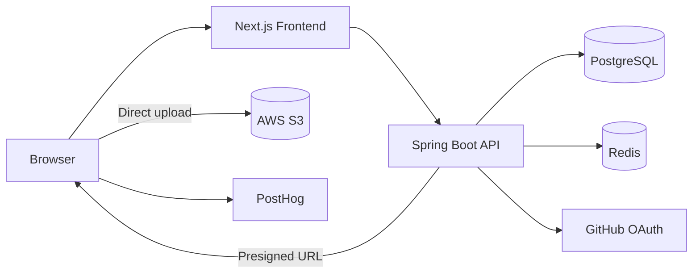

# Rilog

Rilog는 개인 블로그와 팀 블로그인 **Co-log**를 함께 운영할 수 있는 기록 서비스입니다. 글을 쓰고 임시저장하거나 발행하면 피드와 각 블로그에서 읽을 수 있습니다.

## 시스템 개요



화면과 사용자 상호작용은 프론트엔드가, API·인증·도메인 규칙은 백엔드가 맡습니다. 파일은 백엔드가 발급한 Presigned URL로 S3에 직접 올리고, OAuth state와 인증 세션은 Redis에서 관리합니다.

## 저장소 구조

```text
.
├─ frontend/    # Next.js 사용자 애플리케이션
├─ backend/     # Spring Boot API와 도메인 로직
├─ docs/        # 백엔드 가이드, ADR, 팀 하네스
├─ .github/     # 이슈·PR 템플릿과 배포 워크플로우
└─ AGENTS.md    # 저장소 공통 작업 규칙
```

프론트엔드는 `app`, `widgets`, `features`, `domains`, `shared`로 사용자 흐름과 공통 기반을 나눕니다.

백엔드는 도메인별 `controller`·`service`·`repository`와 공통 `global` 영역으로 구성합니다.

## 기술 스택과 현재 역할

### 프론트엔드

- **Next.js 16.3 · React 19.2 · TypeScript 5.9**: App Router로 화면과 레이아웃을 조립하고, TypeScript로 화면 사이의 계약을 확인합니다.
- **Tailwind CSS 4.3**: 공통 디자인 토큰을 바탕으로 UI를 만듭니다.
- **TanStack Query 5 · ky 2**: TanStack Query는 서버 상태와 캐시를, ky는 HTTP 요청과 오류 정규화를 맡습니다.
- **BlockNote 0.53**: 브라우저에서만 필요한 에디터를 별도 경계에서 불러와 글쓰기 기능이 에디터 구현에 묶이지 않도록 합니다.
- **PostHog**: 자동 수집 대신 로그인·발행처럼 의미 있는 성공 행동을 기록합니다.

### 백엔드와 운영

- **Java 21 · Spring Boot 4.1**: REST API, 인증, 도메인 서비스와 외부 연동의 기반입니다.
- **Spring Data JPA · PostgreSQL**: 블로그, 게시글, 멤버십처럼 관계가 있는 데이터를 저장합니다.
- **Redis · GitHub OAuth · JWT**: OAuth 요청 상태를 한 번만 처리하고 인증 세션을 관리하며, Access/Refresh Token 기반 로그인을 지원합니다.
- **AWS S3 SDK**: Presigned URL을 발급해 파일을 서버를 거치지 않고 업로드하고, 업로드 자산의 생명주기를 관리합니다.
- **Vitest · React Testing Library · Playwright · JUnit**: 순수 로직, 컴포넌트 상호작용, 핵심 사용자 흐름, 백엔드 테스트를 나누어 검증합니다.
- **Docker · GitHub Actions · EC2/PM2**: 백엔드는 컨테이너 이미지로, 프론트엔드는 빌드 결과물로 패키징해 배포합니다.

## 로컬 개발

### 사전 준비

- Git
- Node.js 24.19.0과 pnpm 11.21.0
- Java 21
- PostgreSQL과 Redis
- GitHub OAuth 및 AWS S3 접근에 필요한 개발 환경값

### 프론트엔드

```bash
cd frontend
nvm install
nvm use
corepack enable
cp .env.example .env
pnpm install --frozen-lockfile
pnpm dev
```

개발 서버는 기본적으로 `http://localhost:3000`에서 실행됩니다. `.env`에는 API 주소가 필요하며, 업로드와 분석 기능은 S3·PostHog 환경값이 준비된 경우에만 모두 사용할 수 있습니다. 변수 설명과 세부 명령은 [frontend/README.md](frontend/README.md)를 참고하세요.

### 백엔드

백엔드 설정은 실제 인증 정보를 저장소에 두지 않고 환경변수로 받습니다. 로컬 프로필을 실행하기 전에 다음 값을 준비해야 합니다.

| 범주            | 필요한 환경변수                                                           |
| --------------- | ------------------------------------------------------------------------- |
| 데이터베이스    | `DB_URL`, `DB_USERNAME`, `DB_PASSWORD`                                    |
| 캐시            | `REDIS_HOST`, `REDIS_PORT`                                                |
| GitHub OAuth    | `GITHUB_CLIENT_ID`, `GITHUB_CLIENT_SECRET`, `GITHUB_CALLBACK_URI`         |
| 토큰·쿠키       | `ACCESS_TOKEN_*`, `ONBOARDING_TOKEN_*`, `REFRESH_TOKEN_*`                 |
| 저장소·네트워크 | `AWS_S3_BUCKET`, `AWS_REGION`, `AWS_S3_DIRECTORY`, `CORS_ALLOWED_ORIGINS` |

```bash
cd backend
./gradlew bootRun --args='--spring.profiles.active=local'
```

백엔드용 환경변수 예시 파일이나 Docker Compose는 아직 제공하지 않습니다. 팀에서 공유받은 개발용 환경값을 사용하고, 실제 비밀값은 저장소에 추가하지 않습니다.

## 검증

루트에는 통합 실행 명령이 없습니다. 각 애플리케이션 디렉터리에서 필요한 검증을 실행합니다.

```bash
# 프론트엔드
cd frontend
pnpm check
pnpm test:e2e

# 백엔드
cd backend
./gradlew test
./gradlew build
```

`pnpm check`는 포맷, 린트, 타입 검사, 단위·컴포넌트 테스트와 프로덕션 빌드를 실행합니다. Playwright E2E는 브라우저가 필요하므로 핵심 사용자 흐름을 바꾼 경우 별도로 실행합니다. 세부 품질 기준은 [frontend/AGENTS.md](frontend/AGENTS.md)와 [quality-gates.md](docs/harness/quality-gates.md)를 따릅니다.
