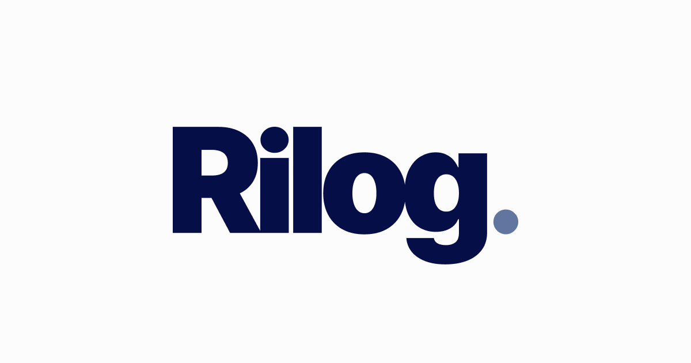
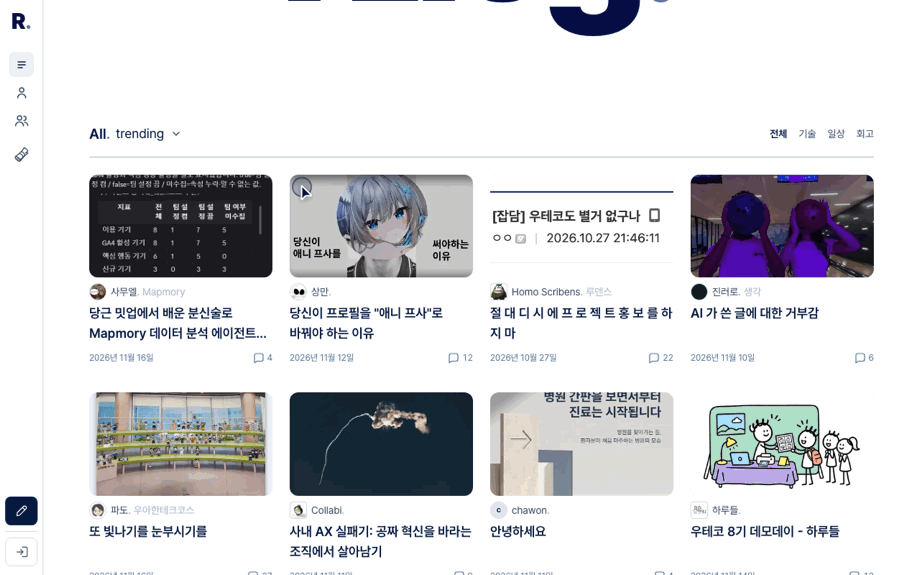
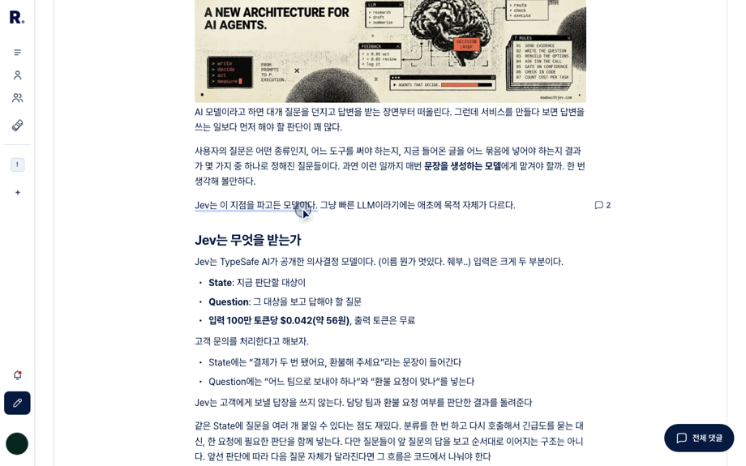
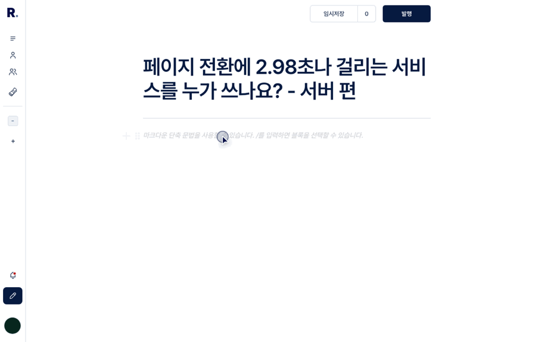
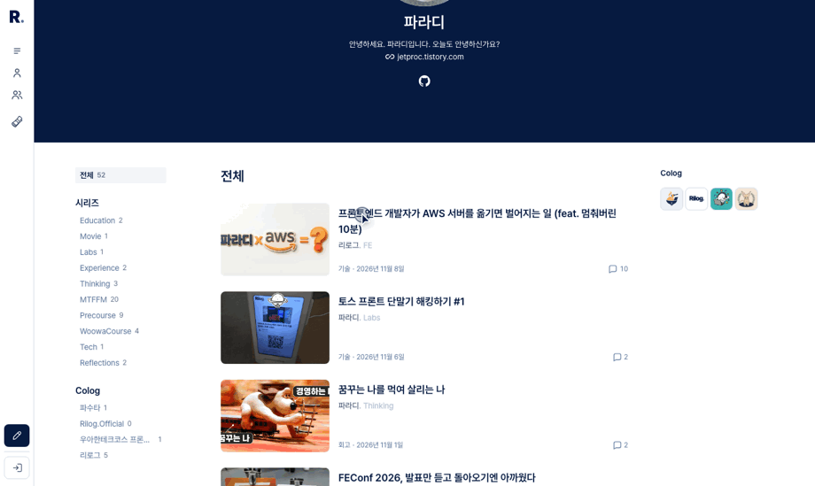
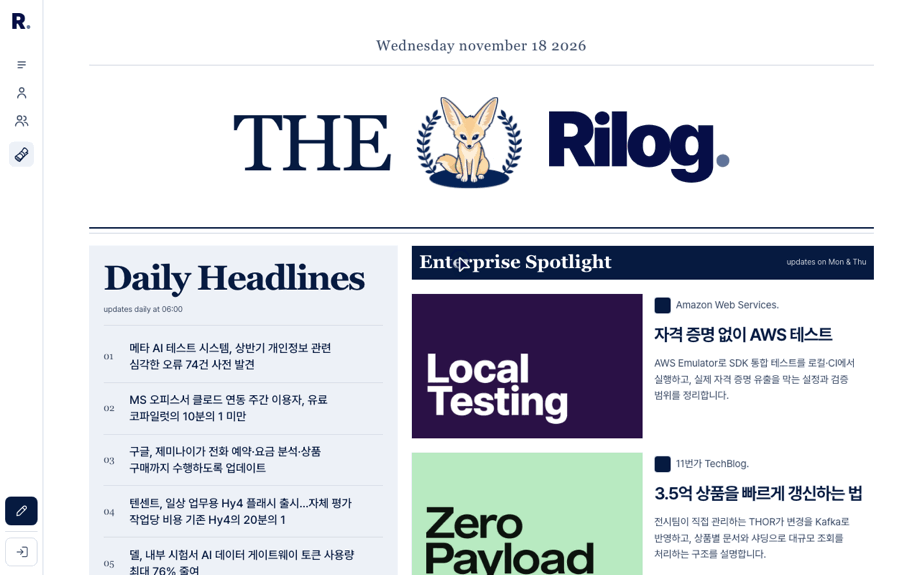
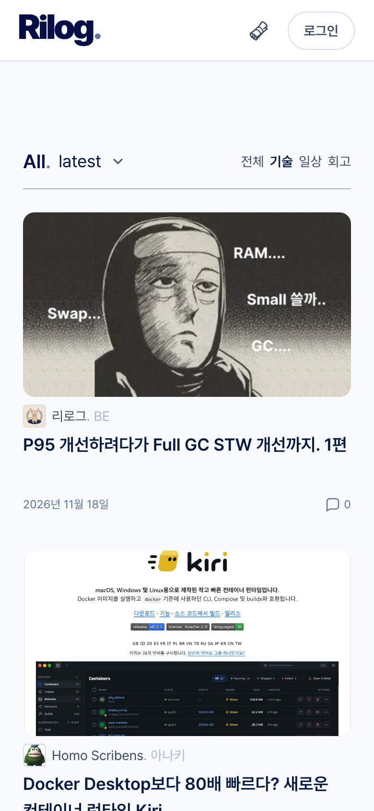
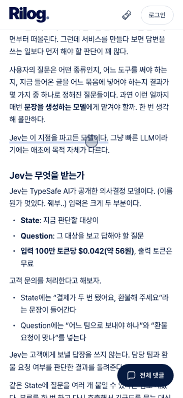
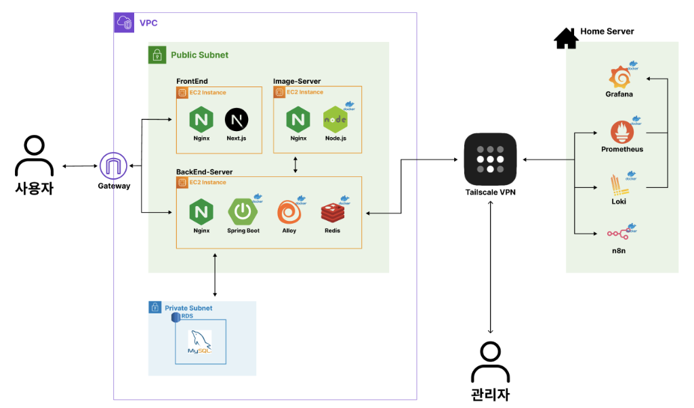

**write deeper. grow together.**

개발자와 팀이 만들고 배우는 과정을 기록하는 블로그 플랫폼

[rilog.kr](https://www.rilog.kr) &nbsp;·&nbsp; [The Rilog.](https://www.rilog.kr/the-rilog) &nbsp;·&nbsp; [About](https://www.rilog.kr/about)

 

| **320+** | **120+** | **25+** |
| :---: | :---: | :---: |
| 발행된 게시글 | 개인 블로그 | 팀 블로그 Colog |

---

## Features

### 카테고리 & 트렌딩 피드

`기술` · `회고` · `일상` 카테고리와 최신·트렌딩 정렬로 관심 있는 주제의 글을 발견합니다.

  

### 문장 위에서 시작되는 인라인 댓글

이야기하고 싶은 문장을 선택해 그 자리에 댓글을 남기고, 인용 문장을 눌러 본문 위치로 바로 이동합니다.

  

### 글쓰기에 집중하는 에디터

`#`으로 제목을 열고, `/`로 인용구를 찾거나 `/토글`을 입력해 토글 목록을 만드는 등 키보드만으로 블록을 빠르게 작성합니다.

  

### 개인 블로그와 팀 블로그 Colog

개인 블로그는 **시리즈**로, 팀 블로그 Colog는 **챕터**로 글을 엮어 기록을 쌓습니다.

  

### 정기 발행 매거진 The Rilog.

매일 오전 6시에 업데이트되는 Daily Headlines와 큐레이션 아티클로 기술 흐름을 읽습니다.

  

### 모바일에서도 이어지는 경험

이동 중에도 피드를 탐색하고, 하단 시트에서 문장별 인라인 댓글 대화를 확인합니다.

| 모바일 피드 | 모바일 인라인 댓글 |
| :---: | :---: |
|  |  |

---

## Getting Started

| 1. GitHub로 시작 | 2. 개인 블로그 기록 | 3. Colog 함께 운영 |
| :--- | :--- | :--- |
| GitHub 계정으로 바로 로그인하고 나만의 블로그 주소(`/@slug`)를 만듭니다. | `/` 슬래시 에디터로 글을 작성하고 시리즈로 묶어 아카이빙합니다. | 팀 블로그 Colog를 개설해 멤버를 초대하고 챕터별로 팀의 여정을 남깁니다. |

---

## Colog Showcase

| | Colog | 대표 기록 |
| :---: | :--- | :--- |
|  | [**Rilog.**](https://www.rilog.kr/@rilog) | [프론트엔드 개발자가 AWS 서버를 옮기면 벌어지는 일](https://www.rilog.kr/@rilog/posts/523) [THE Rilog. - Jev 도입기](https://www.rilog.kr/@rilog/posts/502) |
|  | [**하루들**](https://www.rilog.kr/@harudle) | [RDS에서 EC2 PostgreSQL로 데이터베이스 전환기](https://www.rilog.kr/@harudle/posts/372) [하루들 팀이 일하는 방식을 고쳐온 이야기](https://www.rilog.kr/@harudle/posts/518) |
|  | [**Knot**](https://www.rilog.kr/@knot) | [EP.9 녹음 모델 전사 품질 개선 과정](https://www.rilog.kr/@knot/posts/362) [EP.4 서로 다른 ‘안다’의 기준](https://www.rilog.kr/@knot/posts/262) |
|  | [**UNS**](https://www.rilog.kr/@teamuns) | [Gemini가 2.6초 고민하던 걸 0.2초에: 툴 결정을 Jev에 맡겨도 될까?](https://www.rilog.kr/@teamuns/posts/379) [커넥션풀 부하 강희가 망치 들고 뿌시기](https://www.rilog.kr/@teamuns/posts/304) |

---

## Tech Stack & Architecture

  

| | |
| :--- | :--- |
| **Frontend** | Next.js 16 · React 19 · TypeScript · Tailwind CSS 4 · TanStack Query · BlockNote |
| **Backend** | Java 21 · Spring Boot 4 · JPA · MySQL · Redis |
| **Infra** | AWS S3 · Docker · GitHub Actions · EC2 · n8n · Sentry · PostHog |

---

## Team

|  |  |  |  |
| :---: | :---: | :---: | :---: |
| [**파라디(권순재)**](https://www.rilog.kr/@jetproc) | [**아지(송아영)**](https://www.rilog.kr/@gustn99) | [**송송(송우석)**](https://www.rilog.kr/@koreaioi) | [**러로(진리로)**](https://www.rilog.kr/@jinriro) |
| Frontend | Frontend | Backend | Backend |

 

[공지 블로그 (`@official`)](https://www.rilog.kr/@official) &nbsp;·&nbsp; [Rilog. Colog (`@rilog`)](https://www.rilog.kr/@rilog) &nbsp;·&nbsp; [rilog.admin@gmail.com](mailto:rilog.admin@gmail.com)

